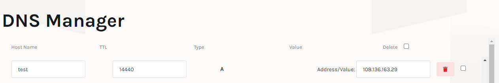

## <div> Simple App Deployment </div>

This document contains the deployment process of the Simple App using Flask, MySQL, and Docker.

## <div> Tools </div>

In this project there are several tools used, including: 

1. Docker.
2. GitHub Action.
3. Amazon EC2 Instance.
4. DNS Server.

## <div> Preparation and Deployment </div>

There are four stages that need to be done to deploy an application to the server and make it accessible.

1. Server Preparation.
2. Compose the App.
3. Create CI/CD Pipeline.
4. Configure web server using Nginx.

## <div> Workflows </div>

### 1. Server Preparation.

In this project, I am using the Ubuntu Operating System running on an __EC2 Instance__ of Amazon Web Services. The instance specifications used are t3.small (2 vCPU, 2 GiB Memory) with a root volume of 8 Gb. There are several stages in preparing the server to be used:

#### Updating the server

```bash
sudo apt update && sudo apt upgrade
```
#### Install Docker

```bash
# Add Docker's official GPG key:
sudo apt-get update
sudo apt-get install ca-certificates curl gnupg
sudo install -m 0755 -d /etc/apt/keyrings
curl -fsSL https://download.docker.com/linux/ubuntu/gpg | sudo gpg --dearmor -o /etc/apt/keyrings/docker.gpg
sudo chmod a+r /etc/apt/keyrings/docker.gpg

# Add the repository to Apt sources:
echo \
  "deb [arch=$(dpkg --print-architecture) signed-by=/etc/apt/keyrings/docker.gpg] https://download.docker.com/linux/ubuntu \
  $(. /etc/os-release && echo "$VERSION_CODENAME") stable" | \
  sudo tee /etc/apt/sources.list.d/docker.list > /dev/null
sudo apt-get update

# Install the Docker packages:
sudo apt-get install docker-ce docker-ce-cli containerd.io docker-buildx-plugin docker-compose-plugin
```

Source: [Docker documentation](https://docs.docker.com/engine/install/ubuntu/)

#### Install Nginx

```bash
sudo apt install nginx -y
```

#### Firewall Configuration

After installing __NGINX__, configure the firewall by setting which ports will be used. We can configure the firewall on the __Security Groups__ used by our server.

#### Firewall Configuration

After installing __NGINX__, configure the firewall by setting which ports will be used. We can configure the firewall on the __Security Groups__ used by our server.


## 2. Compose the App

Next we need to create a configuration so that our application can run in the container we are using.

### Create Custom Docker Image

Next, we need to create a __Dockerfile__ so that the application can run inside a Docker Container.

```dockerfile
FROM python:3.10

COPY . ./app

WORKDIR /app

RUN pip install -r requirements.txt

EXPOSE 5000

CMD ["python", "app.py"]
```

### Create Docker Compose

Next, we need to create __docker compose__ to make it easier for us to configure the services that will be run.

```yaml
version: "3"
services:
  app-prod:
    image: ${APP_IMAGE}:${APP_TAG}
    container_name: app-prod
    ports:
      - 5001:5000
    depends_on:
      - db
    environment:
      - DB_HOST=db
      - DB_PORT=3306
      - DB_NAME=mydatabase
      - DB_USER=myuser
      - DB_PASSWORD=mypassword
    networks:
      - my-network
      
  app:
    build:
      context: ./app
      dockerfile: Dockerfile
    container_name: app-container
    ports:
      - 5001:5000
    depends_on:
      - db
    environment:
      - DB_HOST=db
      - DB_PORT=3306
      - DB_NAME=mydatabase
      - DB_USER=myuser
      - DB_PASSWORD=mypassword
    networks:
      - my-network

  db:
    image: mysql:latest
    container_name: db-container
    ports:
      - 3307:3306
    volumes:
      - mysql-volume:/var/lib/mysql
      - ./db/init.sql:/docker-entrypoint-initdb.d/init.sql
    environment:
      - MYSQL_DATABASE=mydatabase
      - MYSQL_USER=myuser
      - MYSQL_PASSWORD=mypassword
      - MYSQL_ROOT_PASSWORD=rootpassword
    networks:
      - my-network

networks:
  my-network:

volumes:
  mysql-volume:
```

## 3. Create CI/CD Pipeline

After we have prepared the server that will be used to deploy the application, the next step is to create a CI/CD Pipeline using GitHub Actions to automate.

### 3.1 Preparation

First, we need to protect the `main` branch of our repository. This is done so that the merge process can be carried out if a pull request has been approved by the collaborator. Then we can create a CI/CD Pipeline inside the `.github/workflows` directory. In this directory there is a .yaml file that will be used to run the CI/CD process.


### Continuous Integration

The CI process will be run if there is a pull request to the `main` branch. The CI process will carry out the process to build a docker image and the docker image build results will be stored in the docker registry.


### Continuous Deployment

This process will be carried out if a tag is released so that the application will be deployed to the production server. This application on the production server will later be used by the user.


## 4. Configuring Web Server using NGINX

In this process, we need to configure __NGINX__ which acts as a Reverse Proxy which will direct requests from port 80 (HTTP) to the application running on the server

### Add a domain name to the Domain Name Server

First, add the domain name used to the DNS Server.



### Removing the default configuration

Then we need to remove the default NGINX configuration.

```bash
sudo rm /etc/nginx/sites-available/default
sudo rm /etc/nginx/sites-enabled/default
```

### Creating new configuration

After we delete the default configuration from NGINX, then we will create the configuration that we will use.

```bash
cd /etc/nginx/sites-available
sudo nano test.putra988.my.id
```

In the configuration file, we will specify which ports NGINX listens on and the destination port to which requests will be redirected.

```nginx
server {
    listen 80;
    server_name test.putra988.my.id;

    location / {
        proxy_pass http://:public-ip:5001;
    }
}
```

After successfully creating the configuration file, then we activate the configuration file by creating a symlink to the `sites-enabled` directory.

```bash
sudo ln -s /etc/nginx/sites-available/test.putra988.my.id /etc/nginx/sites-enabled
```

Next, check the syntax and test to ensure there are no incorrect configurations.

```bash
sudo nginx -t
```

If there are no errors, now the application can be accessed directly without needing to specify a port.

After changing the Nginx configuration, make sure to restart the Nginx service for the configuration changes to take effect:

```bash
sudo systemctl restart nginx
```

## 5. The Result

After we have carried out all the processes above, we can access the simple app via the domain name used, namely test.putra988.my.id

